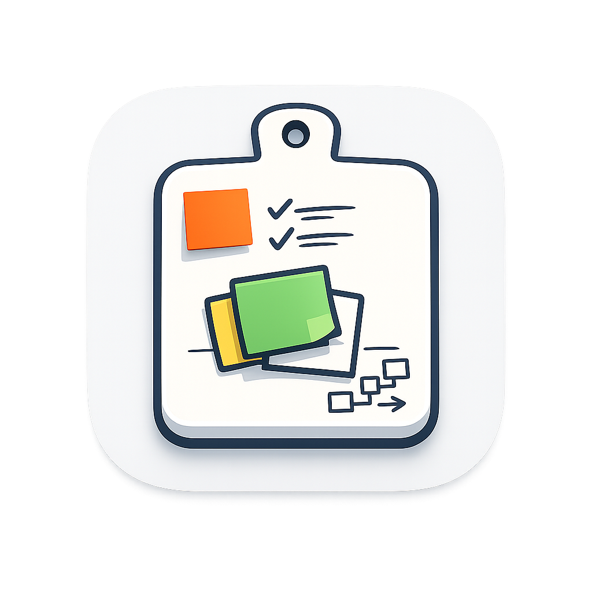

<p align="center"></p>

# Cutting Board

A macOS menu-bar whiteboard for quick diagrams, sticky notes, and annotations — copy to clipboard and paste anywhere.

Open it with a global hotkey, sketch an idea, paste in a screenshot, connect a few shapes, then click **Done** to copy the whole board as a PNG and paste it straight into Slack, a doc, or an issue.

## Features

- **Shape-binding connectors** — arrows bind to the shapes they join and re-route automatically when you move them, so your diagrams stay tidy. (Preview's markup can't do this.)
- **Colored sticky notes** — drop labelled notes in any of tldraw's default colors.
- **Paste-in screenshots** — pull an image straight off the system clipboard onto the canvas to annotate it.
- **One-keystroke copy** — **Done** copies the board to the clipboard as a PNG; paste it anywhere.
- **Always one keystroke away** — a configurable global hotkey toggles the board over whatever you're doing.
- **MCP server** — an [MCP](https://modelcontextprotocol.io) server lets an AI assistant (e.g. Claude) view and edit the live board: add shapes, connect them, drop stickies, or render the board to an image.
- **Menu-bar native** — lives in the menu bar with no Dock clutter; built on Tauri v2 + a tldraw canvas.

## Screenshots

> _Screenshots coming soon._ <!-- TODO: add screenshots of the board, a connected diagram, and the settings panel. -->

## Quick start

**Prerequisites**

- macOS 12 (Monterey) or newer
- [Node.js](https://nodejs.org) 20+
- [pnpm](https://pnpm.io) (the repo pins `pnpm@10`)
- [Rust](https://rustup.rs) (stable toolchain, for the Tauri shell)

**Run it**

```sh
pnpm install
pnpm tauri:dev
```

`pnpm tauri:dev` builds the Rust shell and launches the app (the window is shown automatically in dev). To work on the frontend alone in a normal browser tab — without the menu bar / clipboard / hotkey integration — run `pnpm dev` and open the printed URL.

## Usage

- **Open / close the board** — press the global hotkey (default `⌘⇧Space`). It toggles: press again to dismiss. You can also left-click the menu-bar icon, or use the tray menu's **Open Cutting Board** item.
- **Done (copy to clipboard)** — the **Done** button is a split button:
  - **Copy & Dismiss** (the primary click, also **⌘⏎**) — copies the board PNG and hides the window, keeping the board for next time.
  - **Copy & Discard** (caret menu) — copies, then clears the board and deletes the autosave.
  - **Copy & Keep Open** (caret menu) — copies and leaves the window open.
- **Esc** — dismisses the window *without* copying; the board is kept.
- **Paste in a screenshot** — copy an image (e.g. `⌘⇧⌃4`), then press **⌘⇧V** (or just paste) to drop it onto the board, scaled to fit.
- **Sticky notes** — use tldraw's note tool from the toolbar; recolor via the style panel.
- **Connectors** — draw an arrow from one shape to another and it binds to both; moving either shape re-routes the arrow.
- **Settings** — open from the tray's **Settings…** item (an in-window panel):
  - **Global hotkey** — click the field and press a new chord (needs at least one modifier).
  - **Hide automatically when the window loses focus** — off by default.
  - **Export resolution** — 1×–3× PNG scale (default 2×).

The tray menu has three items: **Open Cutting Board**, **Settings…**, and **Quit**.

## MCP integration

Cutting Board ships a standalone Node [MCP](https://modelcontextprotocol.io) server (`@cutting-board/mcp-server`) so an AI assistant can view and edit the live board while the app is running. It exposes tools to add stickies, shapes, and shape-binding connectors; move/update/delete shapes; clear the board; list shapes; and render the board to a PNG (plus `board://snapshot` and `board://image` resources).

Build it, then register it with Claude Code using the **absolute path** to the bundled entry point:

```sh
pnpm --filter @cutting-board/mcp-server build

claude mcp add --transport stdio cutting-board -- \
  node /ABS/PATH/cutting-board/packages/mcp-server/dist/index.js
```

The **app must be running** for the tools to work (the server connects to a loopback bridge it hosts). See [`docs/mcp.md`](docs/mcp.md) for the full tool/resource reference, example prompts, and the optional `CUTTING_BOARD_AUTO_LAUNCH` env var.

## Building & packaging

Build an **unsigned** macOS bundle:

```sh
pnpm tauri:build                # builds .app and .dmg
pnpm tauri:build --bundles app  # just the .app
```

Code signing and notarization are scaffolded but **disabled by default** — they stay inert until you supply Apple credentials via environment variables:

- `APPLE_SIGNING_IDENTITY` — your Developer ID (use `-` for an ad-hoc signature for local sharing), **plus** one of:
  - `APPLE_ID`, `APPLE_PASSWORD` (an app-specific password), `APPLE_TEAM_ID`; **or**
  - `APPLE_API_KEY`, `APPLE_API_ISSUER`, `APPLE_API_KEY_PATH` (App Store Connect API key).

The bundle uses a hardened runtime and is **not** sandboxed. See [`docs/architecture.md`](docs/architecture.md) for the full packaging rationale.

## Architecture

Cutting Board is three cooperating processes: a **Tauri (Rust) shell** that owns the window, tray, hotkey, clipboard, and persistence; a **WebView frontend** (React 18 + TypeScript + tldraw 3.15) that is the actual board; and a **standalone MCP server** (Node) that drives the board over a loopback WebSocket bridge.

```
 Global hotkey / tray ─► Rust shell ─► shows the WebView board
                              │
   Done ─► tldraw PNG ─► Rust ─► NSPasteboard (clipboard)
                              │
 Claude ──stdio──► MCP server ──WS(loopback)──► Rust bridge ──event──► WebView ──► tldraw Editor
```

See [`docs/architecture.md`](docs/architecture.md) for the process topology and data flows, and [`docs/bridge-protocol.md`](docs/bridge-protocol.md) for the wire format that connects the MCP server to the board.

## Development

This is a pnpm workspace with three packages:

```
packages/
  app/          Tauri shell (src-tauri/, Rust) + React/tldraw frontend (src/)
  mcp-server/   standalone Node MCP server
  protocol/     shared TypeScript bridge types (the single source of truth)
docs/           architecture, bridge protocol, app IPC, MCP, test checklist
assets/         logo.png (app icon source)
```

Common commands (run from the repo root):

```sh
pnpm test        # run all package test suites (vitest)
pnpm typecheck   # typecheck all packages
pnpm build       # build all packages
pnpm icon        # regenerate app icons from assets/logo.png

# Rust shell tests:
cargo test --manifest-path packages/app/src-tauri/Cargo.toml
```

> **Note:** `assets/logo.png` is currently a placeholder. Replace it with the final artwork and run `pnpm icon` to regenerate the app icon set.

OS-level behaviors (global hotkey, clipboard paste, tray, multi-monitor) can't be unit-tested — see [`docs/manual-test-checklist.md`](docs/manual-test-checklist.md) for the per-release manual checklist.

### A note on the global hotkey

The hotkey uses Carbon's `RegisterEventHotKey` (via `tauri-plugin-global-shortcut`), the same mechanism Slack and VS Code use — so it needs **no** Accessibility or Input-Monitoring permission. If the chord you pick is already claimed by another app, it simply won't fire (no error). Pick a different combo in Settings, or use the tray's **Open Cutting Board** item.

### tldraw watermark / license

The free tldraw build stamps a small "made with tldraw" watermark into exported PNGs. Removing it requires a tldraw **commercial or trial license**. If you have one, set the `VITE_TLDRAW_LICENSE_KEY` environment variable — it's read at build time and passed to the canvas. The key is validated client-side, so it's safe to embed in the bundle. Without it, you get the free, watermarked build.

## License

MIT — see [LICENSE](LICENSE).
